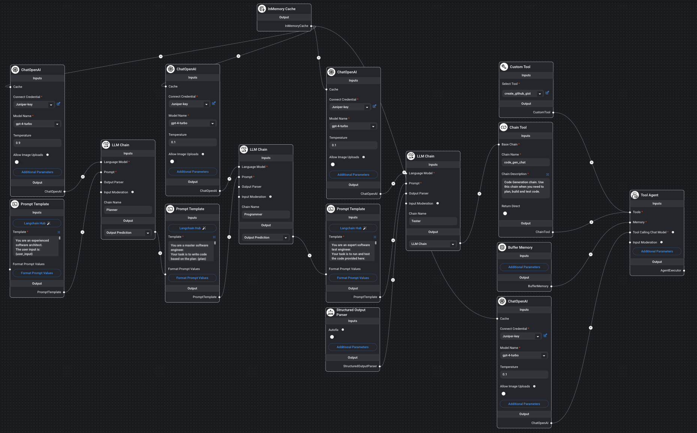

# Code Generataion and validation tool. 

This project is an exploration of how to generate accurate and reliable code 
snippets from user prompts then has the capability to submit the code generated 
to GitHub as a Gist.

### Example user prompts:
"""write a python function that reverses the letter order of each word in the 
string but does not change the order of the words.

Then create a githut gist with the code."""

"""write a python function that finds all child objects in a json array which 
have an 'intf' value of 'Eth1' and a 'mlag' value of 'True'.

Then create a githut gist with the code."""

### Architecture
[Flowise](https://flowiseai.com/) is used for its low-code capabilities and 
easier configuration of [LangChain](https://www.langchain.com/) chains.  
The only hard-coded logic is used by the custom tool [create_github_gist_custom_tool.json](flowise/create_github_gist_custom_tool.json) 
to create a GitHub Gist via the GitHub API.

The [.env](.env) file is the environment file for the [Docker](https://www.docker.com/) 
container and should be moved into the flowise/docker folder after installing Flowise.

This is not a ready-to-use project but a proof of concept repository to store my work.

### Flow Diagram

